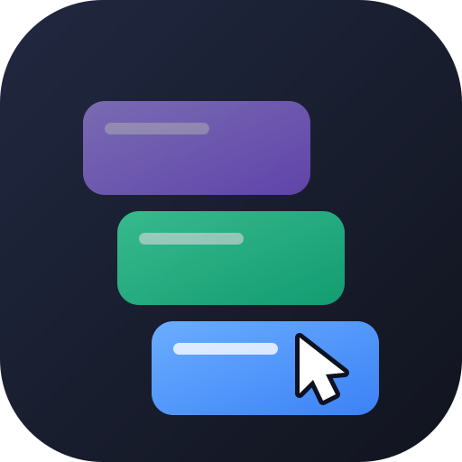

<p align="center">
  
</p>

<h1 align="center">Personae</h1>

<p align="center">
  多身份隔离浏览器 · 每个身份都是独立 partition，每个窗口都能被 AI agent 精确操控
</p>

<p align="center">
  <sub>内置 agent-browser 与 MCP server，用户无需安装 Node 或任何 CLI</sub>
</p>

<p align="center">
  <a href="./README.md">English</a> · <b>中文</b>
</p>

一个 Electron 桌面浏览器，把「多账号隔离」和「让 AI agent 操作浏览器」这两件事拼在一起：

- 每个**浏览器身份**是一个独立的 Chromium `persist:` partition —— cookie、localStorage、登录态完全隔离，同一个网站可以同时登录多个账号；
- 每个身份是一个带前进/后退/地址栏的独立窗口，用起来就是个普通浏览器；
- 内置 [agent-browser](https://github.com/vercel-labs/agent-browser) 二进制，并通过 **MCP** 把这些窗口暴露出去，让 Codex / Claude Code 精确操作**指定身份**的页面。

不需要用户预先安装 Node、Chrome for Testing 或任何 CLI。

## 它解决什么问题

现成的浏览器自动化工具都假设「浏览器由 agent 启动」。但如果你的产品本身就是个浏览器客户端，情况是反过来的：**窗口已经存在，而且分属不同账号身份**，agent 需要的是接进来并且不串号。

这里的做法是：

1. app 启动时开启一个 CDP 端口（随机分配，仅监听回环）；
2. 每开一个身份窗口，主进程用 `Target.getTargetInfo` 取到该窗口内容页的**权威 targetId**；
3. 通过一个本地 bridge 把「身份 → targetId」的映射暴露出去；
4. MCP server 拿 targetId 当 tab ref 直接定位，一步命中。

于是 `snapshot(identity: "账号A")` 和 `snapshot(identity: "账号B")` 永远打在正确的窗口上，即使两个窗口打开的是同一个网站、标题和 URL 完全一样。

## 快速开始

需要 Node ≥ 20 和 pnpm（仅开发时需要；打包后的 app 不依赖它们）。

```bash
pnpm install
pnpm bundle:ab      # 把 agent-browser 二进制与 core skill 复制到 resources/
pnpm dev
```

在界面里添加一两个浏览器身份，点击身份即打开对应窗口。

打包：

```bash
pnpm build:mac      # 或 build:win
```

默认使用 **adhoc 签名**（`identity: '-'`），不需要任何 Apple 开发者证书，产物能在本机正常运行。但 adhoc 签名的 app **不能分发给别人**——对方打开会被 Gatekeeper 拦下。要正式分发，通过环境变量提供证书并把 `notarize` 改为 `true`：

```bash
CSC_LINK=/path/to/cert.p12 CSC_KEY_PASSWORD=... \
APPLE_ID=... APPLE_APP_SPECIFIC_PASSWORD=... APPLE_TEAM_ID=... \
pnpm build:mac
```

## 接入 Codex / Claude Code

### 最省事：让 agent 自己接

界面上有一块**「让 agent 自己接入」**，里面是一段现成的 prompt。复制它，粘给 Codex 或 Claude Code，agent 会自己写配置、重启、然后调 `list_identities` 验证链路通不通。

这段 prompt 不只是配置片段，它还告诉 agent 那 13 个工具分别能干什么、以及哪些坑别踩（ref 跨调用失效、凭记忆猜 agent-browser 语法、靠页面标题区分身份）。内容由运行时的真实值生成，所以里面的路径在当前机器上一定是对的。

### 或者点一下按钮

同一个面板里有「一键配置 Codex」，会把 MCP server 写进 `~/.codex/config.toml`（幂等，写入前自动备份）。路径是运行时从 `process.execPath` 取的，不会写错。

### 或者手动配

macOS 上是：

```toml
[mcp_servers.personae]
command = "/Applications/Personae.app/Contents/MacOS/Personae"
args = ["/Applications/Personae.app/Contents/Resources/mcp-server.mjs"]

[mcp_servers.personae.env]
ELECTRON_RUN_AS_NODE = "1"
```

`Contents/MacOS/` 下的可执行文件名跟随 `productName`，所以是 `Personae`。注意 `electron-builder` 的 `executableName` 只对 Windows 生效。

`command` 指向 app 自己的二进制，配合 `ELECTRON_RUN_AS_NODE=1` 让它退化成纯 Node 运行时。**这样用户机器上不需要装 Node**（已实测：把 `PATH` 设为 `/usr/bin:/bin`，完整流程仍然跑通）。

Claude Code：

```bash
claude mcp add personae \
  --env ELECTRON_RUN_AS_NODE=1 \
  -- /Applications/Personae.app/Contents/MacOS/Personae \
     /Applications/Personae.app/Contents/Resources/mcp-server.mjs
```

## MCP 工具

所有工具都接受 `identity` 参数（身份名或 id）。

| 工具                       | 用途                                                                              |
| -------------------------- | --------------------------------------------------------------------------------- |
| `load_skill`               | 取 agent-browser 当前版本的真实命令语法（默认返回段落目录，`section` 取具体段落） |
| `list_identities`          | 列出所有身份及其打开状态、当前 URL                                                |
| `open_identity`            | 打开某个身份的窗口                                                                |
| `snapshot`                 | 无障碍树快照，返回 `[ref=eN]` 元素引用                                            |
| `navigate`                 | 导航到 URL                                                                        |
| `click` / `fill` / `press` | 交互；`click` 支持按 ref 或按可读文本定位                                         |
| `act`                      | 在同一个 agent-browser 进程里执行多条命令                                         |
| `get_text` / `get_url`     | 读取内容                                                                          |
| `screenshot`               | 截图                                                                              |
| `eval_js`                  | 执行 JS                                                                           |

`click` / `fill` 传 `@eN` 时会自动前置一次 snapshot，因为 **ref 只在单个 agent-browser 进程内有效**，跨进程复用必然报 `Unknown ref`。需要多步操作时用 `act` 把它们放进同一个 batch。

## 架构

```
┌─────────────────────────────────────────────────────────┐
│  Electron 主进程                                         │
│                                                          │
│  ├─ CDP server（端口 0 → 系统分配，仅 127.0.0.1）        │
│  ├─ IdentityManager   身份存档 / 窗口生命周期 / targetId  │
│  └─ Agent Bridge      本地 HTTP，暴露身份↔targetId 映射   │
└───────────┬─────────────────────────────────┬────────────┘
            │                                 │
  ┌─────────▼──────────┐          ┌───────────▼───────────┐
  │ 身份窗口（每身份一个）│          │  发现文件              │
  │                     │          │  userData/            │
  │ BrowserWindow 外壳   │          │  agent-bridge.json    │
  │  ├ WebContentsView  │          │  （端口每次启动都变，   │
  │  │   顶栏 chrome.html│          │    靠固定路径发现）    │
  │  └ WebContentsView  │          └───────────┬───────────┘
  │      内容（partition）│                      │
  │      ↑ agent 操作这里 │                      │
  └─────────────────────┘                      │
                                                │
            ┌───────────────────────────────────▼─────────┐
            │  scripts/mcp-server.mjs（stdio JSON-RPC）    │
            │  读发现文件 → 取 targetId → 调 agent-browser │
            └───────────────────┬─────────────────────────┘
                                │
                    ┌───────────▼────────────┐
                    │  Codex / Claude Code   │
                    └────────────────────────┘
```

### 为什么身份窗口是「外壳 + 两个 WebContentsView」

需要在第三方网页外面套一层自己的导航栏 UI，同时不使用 `<webview>` 标签。所以：

- 外壳 `BrowserWindow` 只作容器，加载 `about:blank`；
- 顶栏是本地 `chrome.html`，用专用 preload 只暴露 6 个导航方法；
- 内容区是 `WebContentsView`，partition 在这里生效，**刻意不加载任何 preload**，保持第三方页面干净。

`BrowserWindow` 嵌套和 `BrowserView` 也都能实现，agent 同样能操作（都实测过）。选 `WebContentsView` 的理由是：`BrowserView` 在 Electron 类型定义里已标记 `@deprecated`；嵌套窗口在 macOS 是独立原生窗口，拖动/缩放/最小化都要手动同步 bounds，做不出「一个浏览器窗口」的观感。

## 开发中踩到的坑

留在这里，因为它们大多不在文档里。

**CDP 端口是浏览器进程级的。** `--remote-debugging-port` 是进程级 switch，`webPreferences` 里没有对应选项，所以**一个 Electron app 只有一个 CDP server**，无法给每个窗口单独开端口。用端口 `0` 让系统分配，再从 `userData/DevToolsActivePort` 读回；该文件的写入早于 bind 成功，所以还要用 `/json/version` 探活。

**`--pin-tab` 在 Electron 上直接失败。** 它会触发 `Target.createTarget`，Electron 报 `Not supported`。更麻烦的是 **pin 状态是粘性的**，一旦某个 session 用过就会持久写入 session 状态，`close --all` 也清不掉，之后所有命令都失败。所以每次调用都显式传 `--no-pin-tab`。

**空 title 的 page target 会让 agent-browser 挂死。** 外壳窗口若不 `loadURL`，在 CDP 里就是 url 和 title 全空的 page target，agent-browser attach 到它会直接卡住不返回（`tab list` 无响应，超时都不给）。所以外壳必须加载 `about:blank` 并设一个可读 title。

用 `about:blank` 而不是 `data:text/html,<title>...` —— 后者里的中文会被按 latin-1 解读成乱码（「账号B」显示为 `è´¦å·B`）。

设 title 还有个竞态：`about:blank` 加载极快，`did-finish-load` 可能在事件注册前就已触发，导致并发打开多身份时后打开的那个 title 停在 `about:blank`。解法是同步 `setTitle` 一次 + 加载完成后再补一次。

**不要靠 title / url / tab index 区分身份。** 多个身份打开同一站点时 title 和 url 完全相同；而 CDP target 顺序与 agent-browser 的 tab index 顺序并不一致，也不能靠索引推算。只能用 targetId。

**agent-browser 的 skill 内容按版本变化，别照抄网上的文档。** 它自带的 SKILL.md 明确写着自己不含命令语法，要求先 `skills get` 向 CLI 索取。这一点被本项目实证：网上写的 `tab --url "*settings*"` 和 `--pin-tab` 在早期版本根本不存在，而 `tab list --json` 输出 `targetId` 是较新版本才有的能力 —— 本项目的整个定位方案就是建立在它之上。

**agent-browser 默认从二进制所在位置向上查找 `skills/` 目录**，可能撞到无关项目的同名目录。必须显式传 `AGENT_BROWSER_SKILLS_DIR`。

**打包时二进制不能只靠 `asarUnpack`。** `asarUnpack` 会把文件放到 `app.asar.unpacked/resources/bin/`，而代码里的 `process.resourcesPath` 指向 `Contents/Resources`——两者不是同一个位置，打包后直接找不到二进制。要走 `extraResources` 让路径对齐；`asarUnpack` 只留真正被 `?asset` import 的文件，否则同一份二进制会被打包两次。

**macOS 上不能简单地「不签名」。** 设 `identity: null` 会让 electron-builder 完全跳过签名，bundle 保留 Electron 原始的 adhoc 签名，但资源已被改过，签名与内容不匹配，app **静默拒绝启动**（无报错、无日志，`spctl` 报 `code has no resources but signature indicates they must be present`）。正确做法是 `identity: '-'` 做 adhoc 签名，并在 entitlements 里加 `com.apple.security.cs.disable-library-validation`（`entitlements` 和 `entitlementsInherit` 都要配，前者管主进程）。

**userData 目录名跟 `package.json` 的 `name`，可执行文件名跟 `productName`。** 这是两个不同字段，而 `executableName` 只对 Windows 生效——两者不一致时很容易找错目录。本项目特意把它们都设成 `Personae` 来规避。（Linux 上要留意：它的文件系统区分大小写，早期用小写名建的目录不会被找到。）

**`publish: generic` + 假 URL 会让打包在最后一步崩掉。** electron-builder 模板默认给的是 `provider: generic` + `url: https://example.com/auto-updates`。改成 `provider: github` 后，它会在打包末尾尝试推断 release channel，本地没有 owner/repo 上下文时直接抛 `TypeError: Cannot read properties of null (reading 'channel')` —— 包已经打好了，却以失败退出。本项目发布走 CI 里的 `gh release upload`，所以直接设 `publish: null`。

**GitHub Actions 的 job 级 `if` 拿不到 `matrix` 上下文。** 写 `if: inputs.platforms == matrix.name` 想按输入过滤平台是**静默失效**的（`actionlint` 会报 `context "matrix" is not allowed here`，但 GitHub 本身不报错），结果不管选什么都构建全部平台。要在前置 job 里动态生成 matrix JSON，再用 `fromJSON` 喂给 `strategy.matrix`。

**用 Electron 渲染 SVG 时要挡掉 `window-all-closed`。** 图标生成脚本是「建窗口 → 截图 → 销毁 → 建下一个」的循环，每次 `destroy()` 都让窗口数归零，Electron 默认据此退出整个 app —— 表现是只渲染出第一个尺寸就崩，子进程报 `No rendezvous client, terminating process (parent died?)`，看起来像时序问题但重试无效。注册一个空的 `window-all-closed` 处理器即可。

另外两点：Retina 屏上 `capturePage` 默认按 devicePixelRatio 输出（请求 512 得到 1024），要锁 `zoomFactor` / `deviceScaleFactor`；稍长的 SVG 内联成 `data:text/html;base64,...` 会超长导致 `loadURL` 报 `ERR_FAILED (-2)`，改用临时文件 + `file://` 引用。

## 已知限制与安全说明

- **隔离是约定层，不是架构层。** CDP 端口没有访问控制。虽然只监听回环且端口随机，但任何能连上它的本地进程都可以操作**所有**身份，跨越 partition 边界。这是「让外部 agent 能接入」的直接代价。不要在多用户共享的机器上处理敏感账号。
- **所有跳转被拦在窗口内。** `setWindowOpenHandler` 把 `window.open` 和 `target="_blank"` 都改成在当前窗口导航，以保证一个身份始终对应一个 target。代价是**会破坏依赖弹窗的 OAuth 登录流程**。
- **每个身份占 3 个 CDP page target**（外壳 + 顶栏 + 内容），身份数 × 3。
- **捆绑的 agent-browser 版本被钉死**在构建时的版本，上游修复不会自动获得。
- 目前只在 macOS (arm64) 上实测过，含打包产物（`electron-builder --dir`）。`bundle:ab` 会按当前平台捆绑，Windows / Linux 未验证。
- **adhoc 签名不可分发**：默认产物只能在本机运行，给别人会被 Gatekeeper 拦。正式分发需要自备证书并开启公证。
- **Codex 侧未用真实客户端验证**：MCP 协议流程是用脚本扮演客户端测通的（包括打包产物 + 无 Node 环境），但没有用真实的 codex 跑一遍。

## 项目结构

```
src/main/
  cdp.ts          CDP 端口开启与发现、targetId 获取
  identity.ts     身份存档、窗口生命周期、导航栏 IPC
  agent-bridge.ts 本地 HTTP bridge + 发现文件
  mcp-setup.ts    Codex 配置一键写入
  index.ts        主进程入口与 IPC 注册
src/shared/
  colors.ts       身份色板 —— 主进程和渲染进程都从这里取，
                  所以窗口顶栏的色点和列表里的颜色一定一致
src/preload/
  index.ts        主界面 API
  chrome.ts       顶栏专用 preload（只暴露导航方法）
src/renderer/
  chrome.html     导航栏 UI
  src/App.tsx     身份管理与接入面板
  src/agent-prompt.ts    生成那段可直接粘给 agent 的 prompt
  src/assets/fonts/      自托管的拉丁子集字体（CSP 挡掉了外部字体 CDN，
                         中文回退到系统 PingFang）
scripts/
  mcp-server.mjs           MCP server（stdio JSON-RPC）
  bundle-agent-browser.mjs 捆绑二进制与 core skill
  make-icons.mjs           SVG → PNG / icns / ico
design/logo/
  icon.svg                 图标源文件（改这个，然后跑 pnpm icons）
  concept*.svg             设计过程中的备选概念稿
.github/workflows/
  release.yml     打包并发布到 GitHub Release（手动触发）
  check.yml       lint / typecheck / 打包冒烟（手动触发）
```

`resources/bin/` 和 `resources/skills/` 由 `pnpm bundle:ab` 生成，不入库。

## 图标

图标源文件是 `design/logo/icon.svg`（三张互不相交的彩色卡片代表三个隔离身份，指针代表 agent 操控）。改完 SVG 后重新生成各平台格式：

```bash
pnpm icons
```

会产出 `build/icon.png`（1024）、`build/icon.icns`、`build/icon.ico` 和 `resources/icon.png`（512，运行时窗口图标）。

生成走的是 **Electron 内置 Chromium**，不需要 rsvg-convert / Inkscape / ImageMagick —— 这些工具在干净环境里通常都没有，而 Electron 是本项目必然存在的依赖。`.icns` 用系统 `iconutil` 打包，`.ico` 直接按格式拼字节。

## 发布

两个工作流都**只能手动触发**（`workflow_dispatch`），不会因为 push 或打 tag 自动跑。

到 GitHub 的 **Actions** 页面选择工作流 → **Run workflow**：

| 工作流              | 用途                        | 参数                                                                                |
| ------------------- | --------------------------- | ----------------------------------------------------------------------------------- |
| **Build & Release** | macOS + Windows 打包并创建 Release | 版本号（可留空）、平台（all / macos / windows）、是否建 Release、是否预发布 |
| **Check**           | lint + typecheck + 打包冒烟 | 是否跑打包                                                                          |

Release 以**草稿**形式创建，确认产物无误后再手动点 Publish。若 tag 已存在，会往已有 Release 追加文件（`--clobber` 覆盖同名），重跑不会直接失败。

发布不走 electron-builder 自带的 publish（`electron-builder.yml` 里 `publish: null`），而是由一个汇总 job 用 `gh release upload` 统一上传。原因是三个平台并发时各自去创建同一个 Release 会互相覆盖。

CI 上 macOS 产物同样是 adhoc 签名。要正式签名，在仓库 Secrets 里配 `CSC_LINK` / `CSC_KEY_PASSWORD`，并把 `electron-builder.yml` 的 `notarize` 改为 `true`。

## License

MIT，见 [LICENSE](./LICENSE)。

捆绑的 [agent-browser](https://github.com/vercel-labs/agent-browser) 采用 Apache-2.0，版权归其作者所有。
